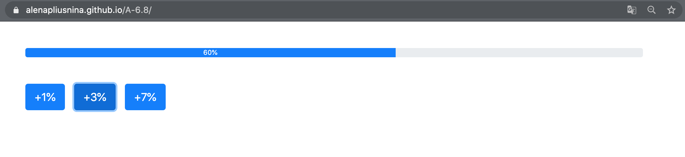

# A-6.8

ТЗ:
   
    Написать html код с прогрессбаром, тремя кнопками и пометками: “+1%”, “+3%” и “+7%”. 
    Нажатие на соответствующую кнопку увеличивает значение прогрессбара.

Реализация:

   - https://alenapliusnina.github.io/A-6.8/

